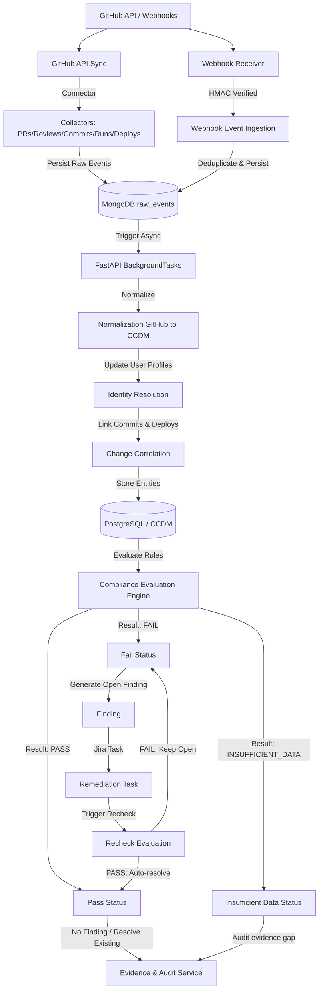
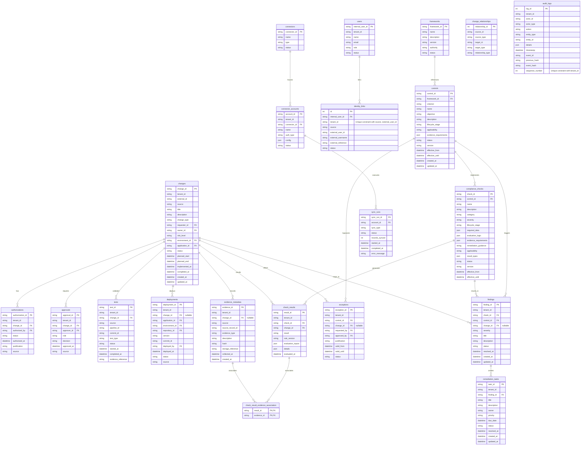

# Architecture & Design Document: Change Management Foundation Layer (Revised)

This document outlines the architectural foundation for the **Enterprise Compliance Automation Platform** (Phase 1), designed around **SOC 2 CC8.1 Change Management** requirements.

---

## 1. Compliance Architecture Flow

The foundation decouples compliance rules from connector logic, ensuring the platform is completely vendor-neutral and deterministic:

```
[SOC 2 CC8.1 Framework]
         │
         ▼
 [Control Library] (Internal Controls e.g. CM-CONTROL-01)
         │
         ▼
  [Check Library] (Config-driven Specs e.g. CM-001)
         │
         ▼
[Common Change Data Model] (Vendor-neutral Domain schemas)
         │
         ▼
[Relational Database Schema] (PostgreSQL/SQLAlchemy tables)
         │
         ▼
[Connector Contracts] (BaseConnector APIs e.g. GitHub/Jira)
```

### 1.2 Platform Ingestion and Runtime Architecture Flow

The runtime ingestion, evaluation, and evidence processing pipeline is structured as follows:



---

## 2. Project Folder Structure

The project code is structured as follows:

```
backend/
├── app/
│   ├── core/                  # Configurations, global settings
│   │   ├── config.py          # Environment settings
│   ├── domain/                # Pure domain models (Pydantic / Interfaces)
│   │   ├── frameworks/        # CC8.1 framework models
│   │   ├── controls/          # Control library definitions
│   │   │   ├── models.py      # Control schemas
│   │   │   └── library.json   # 11 seed control definitions
│   │   ├── checks/            # Compliance checks definitions
│   │   │   ├── models.py      # Check schemas
│   │   │   └── library.json   # 15 automation check definitions
│   │   ├── changes/           # Common Change Model domain entities
│   │   ├── identity/          # Users and third-party identity link schemas
│   │   ├── evidence/          # Evidence storage contracts & schemas
│   │   ├── findings/          # Compliance findings schemas
│   │   ├── exceptions/        # Policy exception schemas
│   │   └── raw/               # MongoDB raw event schemas
│   ├── db/                    # Session management and engine settings
│   │   ├── base.py            # SQLAlchemy Base & Mixins
│   │   ├── postgres.py        # Postgres connection pooling
│   │   └── mongodb.py         # MongoDB connection helpers
│   ├── models/                # SQLAlchemy ORM models mapping to tables
│   │   ├── orm.py             # Table columns & relationships definitions
│   └── connectors/            # Base interfaces for data collection
│       └── contract.py        # BaseConnector contract & structures
├── migrations/                # Alembic versioned migration histories
└── tests/                     # Unit test suite verifying domain, database, contracts
```

---

## 3. Entity Relationship Diagram (ERD)

The following diagram illustrates the relational database schema implemented in PostgreSQL:



---

## 4. Architectural Rules and Security Clarifications

### 4.1 Tenancy boundaries
All transactional and identity tables contain a `tenant_id` column. This enables multi-tenant SaaS architecture in later phases. All compliance engine queries must filter by `tenant_id` to prevent cross-tenant data leaks.
- **Identity Links**: Enforces a database uniqueness constraint `uq_identity_link_tenant_source_ext_id` on `(tenant_id, source, external_user_id)`. This ensures that a single external ID (e.g. Github account or Jira user) cannot map to multiple users within the same tenant.

### 4.2 Connector Account Security & Credentials
The `config` payload inside `connector_accounts` MUST NOT store raw authentication tokens (such as GitHub personal access tokens or Jira passwords) in production.
- **Production**: Config stores a reference ARN or path pointer (e.g. `/secrets/tenant-abc/github-token` or AWS Secret Manager ARN). The Collector engine in Phase 2 is responsible for resolving the actual token dynamically.
- **Local Dev/Testing**: Environmental credentials can be used dynamically using `.env`.

### 4.3 Database Immutability & Verifiability
- **MongoDB raw_events**: The SHA-256 payload hash acts as an **integrity verification** mechanism. It ensures that collected events are not modified after ingestion. Tamper-evident storage and write-once-read-many (WORM) storage configurations (e.g., S3 Object Lock) are left for later integration.
- **Audit Logs**: The table contains `previous_hash` and `event_hash` columns. During write-operations, each log entry computes a SHA-256 hash over its contents and the preceding row's hash. 
  - **Ordering rule**: Enforced via a unique constraint `uq_audit_log_tenant_seq` on `(tenant_id, sequence_number)` alongside timestamps. This sequence number guarantees a deterministic ordering of log verification, resolving any ambiguity under concurrent events.

### 4.4 Traceability and Evidence Cardinality
- All deployments must be linked to a target application, environment, repository, and git commit hash. If `change_id` is null, the deployment is marked as an **unauthorized bypass change** and triggers a `CM-014` finding.
- Junction mappings are bridged via `change_relationships` using strictly controlled `EntityType` and `RelationshipType` enums.
- **Evidence Cardinality**: Programmatic evaluations represented by `check_results` are linked to multiple evidence items via the junction table `check_result_evidence_association` rather than a one-to-one link. This allows evaluations like `CM-005` (Testing before deployment) to bundle testing pipeline reports, git commit hashes, and CD logs as joint proof.
